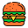

# How to Create a Responsive Navigation Bar

## Tools and Resources
Used [this tutorial](https://www.freecodecamp.org/news/how-to-build-a-responsive-navigation-bar-with-dropdown-menu-using-javascript/) by [Vistor Eke](https://github.com/Evavic44/responsive-navbar-with-dropdown) as a guide.

Used [Flaticon](https://www.flaticon.com/) for some flat icons...

## Overview
This project will guide you through the steps to *learn* how to create your own responsive navigation bars. I will not focus on making things too pretty. That will be your job. Something you can do to take this project further and make it your own. I'll also keep the complexity to minimum where ever I can.

Important note, this is a work in progress.

That's all! Let's make this thing!

## Phase Zero: File Structure
Computers just ove files, don't they? :P Let's create our initial file structure. Something like this should be a good place to start:
```
nav-bar-project/
    index.html
    style.css
    script.js
    assets/
```

## Phase One: HTML
**Step 1**
Let's just generate some basic boiler html. Might as well make a css file and link that in the head. Your html file should look like this:
```
<!DOCTYPE html>
<html lang="en">
<head>
    <meta charset="UTF-8">
    <meta name="viewport" content="width=device-width, initial-scale=1.0">
    <title>Responsive Nav Bar</title>
    <link rel="stylesheet" href="style.css">
</head>
<body>
    
</body>
</html>
```
**Step 2**
Now let's make create some html elements. I'm going to create sections or containers for our nav bar. Three of them actually. Between our `body` element tags, let's add some stuff.
```
<header>
    <div class="left-nav"></div>
    <div class="mid-nav"></div>
    <div class="right-nav"></div>
</header>
```
The reason for this will become apparent as we go.
By the way, if you're using some version control system, this would be a good time to commit.
**Step 3**
I'm imagining that this nav is for some web app, aka a business or organization. And who loves logos more than businesses?! So we know our first element is going to be a logo. You can choose anything you like. Maybe this is a profile pic or something, idk.
Whatever it is, throw it in our `assets` folder:
```
assets/
    your-thing.jpg
```
Now we update out html. This is what my `left-nav` div looks like:
```
<div class="left-nav">
    <a class="logo" href="">
        
    </a>
</div>
```
I got my asset from [favicon > alien monster](https://favicon.io/emoji-favicons/alien-monster). Cute stuff <3

**Step 4**
Now we get into what will become nice dropdown menus. In fact, we going to create a div element with a class of `menu`. Ain't that nice. Here's my updated `left-nav`:
```
<div class="left-nav">
    <a class="logo" href="">
        
    </a>
    <div class="menu"></div>
</div>
```
We're going to need stuff inside our `menu`, right? So let's add stuff! I'm going to model my nav bar after a totally hypothetical, not-at-all-possible blog that I will 100% not use some day (heavy sarcasm). But you can do whatever, as long as you have enough stuff to work with.
Let's add our stuff! Mine came out like this:
```
<div class="menu">
    <ul class="menu-list">
        <li>
            <button class="dd-btn">About</button>
            <div class="dd-about">
                <ul>
                    <li><a href="">Political Framework</a></li>
                    <li><a href="">Personal Background</a></li>
                    <li><a href="">Flavor and Filler</a></li>
                </ul>
            </div>
        </li>
        <li>
            <button class="dd-btn">Blog</button>
            <div class="dd-blog">
                <ul>
                    <li><a href="">Most Recent</a></li>
                    <li><a href="">My Favorites</a></li>
                    <li><a href="">My Least Favorites</a></li>
                </ul>
            </div>
        </li>
        <li>
            <button class="dd-btn">Projects</button>
            <div class="dd-projects">
                <ul>
                    <li><a href="">Project One</a></li>
                    <li><a href="">Project Two</a></li>
                    <li><a href="">Project Three</a></li>
                </ul> 
            </div>
        </li>
    </ul>
</div>
```
That's a lot to take in. So here's the breakdown:
- I created a `ul` element with `class="menu-list"` to hold our whole menu. A container.
- Then I created three more `li` elements, like boxes within a larger box.
- Then I added `button` elements to each one. These will be our "top level" navigation controls. The plan is for users to interact with these to trigger the dropdown, maybe click, maybe hover, maybe a little dance. Who knows.
- Under each button I created yet another container that will hold a small list of links.
- Oh! "dd" stands for "dropdown". And "btn" stands for "button". Incase that wasn't clear ^_^

**Step 5**
I like the idea of a contact form. But since I don't know how to implement that, let's go with something else.

Rather than my original idea of creating a dropdown contact form, let's just add a dropdown "info" menu. In this little thing, we're going to put our contact information, and a handy little "copy to clipboard" button. We'll figure this out later.

Lez go!

Oh also, this is gunna live in the `mid-nav` element.
This is what I did:
```
<div class="mid-nav">
    <div class="contact">
        <button class="contact-btn">Email Me</button>
        <div>
            <p>rowen.floarea@proton.me</p>
            <span></span>
        </div>
    </div>
</div>
```
I found a doofy little clipboard icon on [Flaticon > clipboard](https://www.flaticon.com/free-icons/clipboard). I think it's cute.

**Step 6**
HAMBURGEEEERRRRRZZ

Okay, so, here's the part where we add that little Crabby Patty that people love so much. It'll become a useful tool for displaying our menu at small screen sizes. (and we'll hide it for larger screen).

Now, go grab yourself a "hamburger" icon of whatever sort you like. I used [this page](https://www.flaticon.com/free-icons/hamburger). Lot's of fun stuff to choose from.

Download it and chuck that thing into your assets folder.

Now let's add it to our nav. It's going to go in the `right-nav` element. Mine looks something like this:
```
<div class="right-nav">
    <a href="#">
        
    </a>
</div>
```

You made it!!! Woah! I made it too :D Pretty cool stuff so far. I mean, the page looks like shit, but hopefully you learned something. And it's not over yet. In phase two we're going to start styling things. Fun stuff!

## Phase Two: CSS
Let's jump right in by undoing some default styles:
```
* {
    box-sizing: border-box;
    padding: 0px;
    margin: 0px;
}

ul {
    list-style: none;
}

button {
    border: none;
    background-color: transparent;
    cursor: pointer;
}
```
Looks a bit nicer to me.
->->->------------ TO BE CONTINUED ---------------->